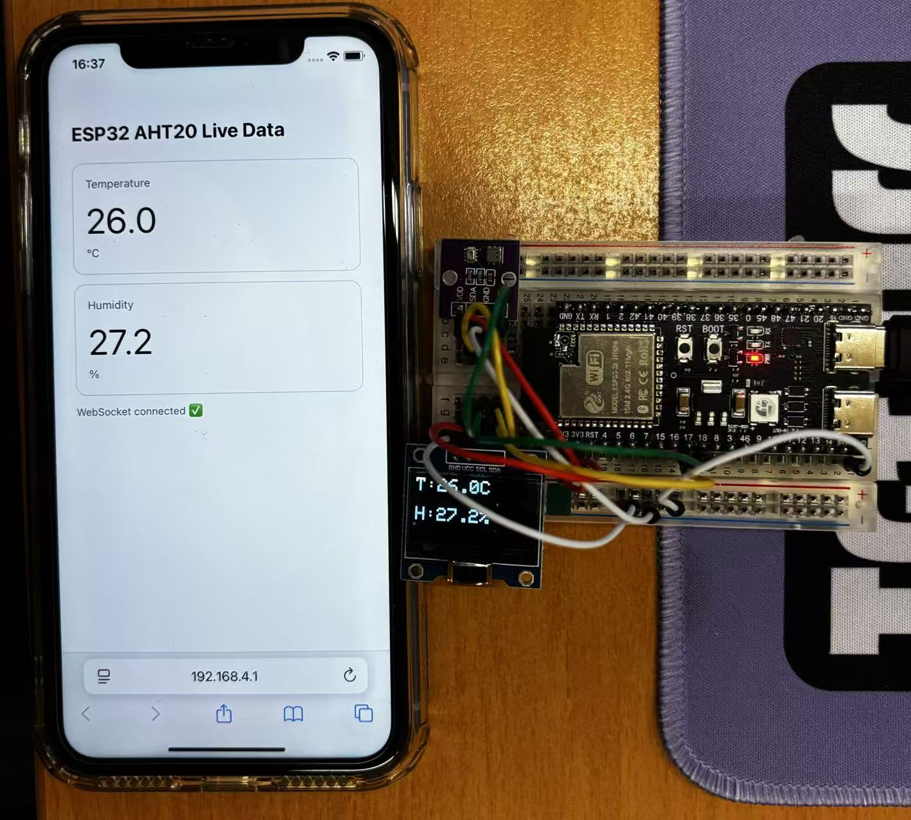

# ESP32-S3 + OLED + AHT20

## Components

- ESP32-S3 dev board  
- I²C OLED display (SSD1306, address 0x3C)  
- AHT20 temperature & humidity sensor (address 0x38)

---

## I²C Pins (ESP32-S3)

- SDA → GPIO17  
- SCL → GPIO18  

---

## Power (3.3 V)

- 3V3 → OLED VCC + AHT20 VDD  
- GND → OLED GND + AHT20 GND  

---

## OLED Connections

- VCC → 3V3  
- GND → GND  
- SDA → GPIO17  
- SCL → GPIO18  

---

## AHT20 Connections

- VDD → 3V3  
- GND → GND  
- SDA → GPIO17  
- SCL → GPIO18  

---

## Wiring Diagram

---

# WiFi + Web Dashboard

This project supports real-time web monitoring via WiFi.

The ESP32 runs in **SoftAP mode**, creating its own wireless network and hosting a local web server.

---

## WiFi Information

- SSID: `ESP32_AHT20_DEMO`
- Password: `12345678`
- Local IP: `192.168.4.1`

---

## How to View Data on iPhone

1. Connect to WiFi network: **ESP32_AHT20_DEMO**
2. Open Safari
3. Visit: http://192.168.4.1

The web page displays:

- Real-time Temperature
- Real-time Humidity

Data is updated via WebSocket communication.

---

## Features

- OLED local display  
- AHT20 temperature & humidity measurement  
- ESP32 WiFi SoftAP mode  
- Built-in web server  
- Real-time WebSocket dashboard  
- No mobile app required  

---

## System Architecture

ESP32-S3  
→ Reads AHT20 via I²C  
→ Displays data on OLED  
→ Creates WiFi Access Point  
→ Hosts HTTP server  
→ Pushes sensor data via WebSocket  
→ Browser displays live dashboard  
